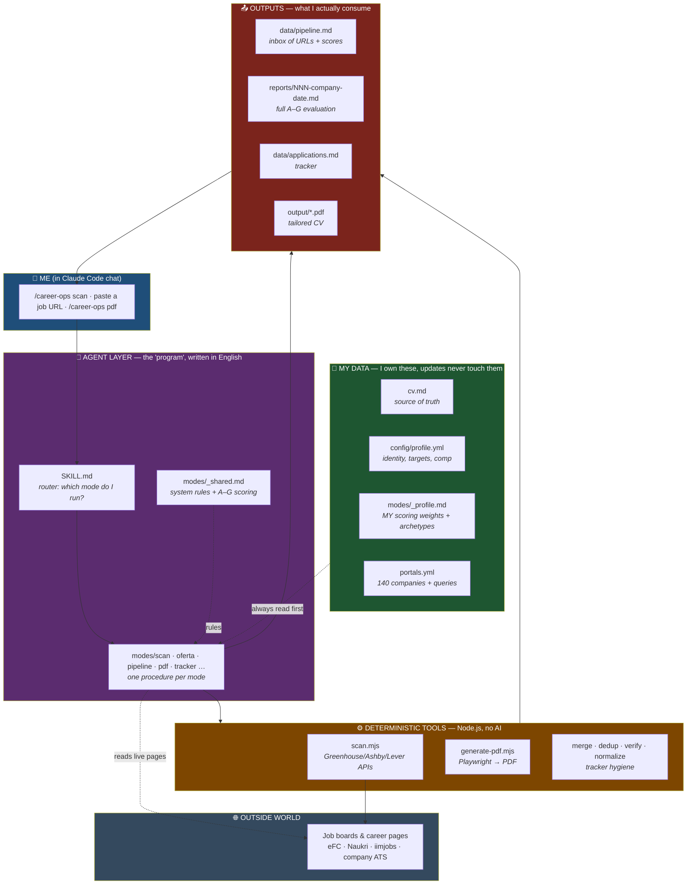
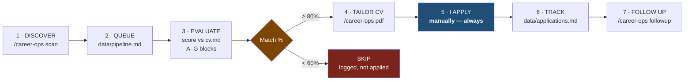

# README — Abhishek's Guide to This Repo

**Who this is for:** me — a Senior/Lead C++ engineer (11 yrs, HFT / exchange connectivity / FIX), *not* an AI developer.
**What it explains:** what this repo actually is, how the pieces fit together, and which 6 files I ever need to touch.

Companion doc: [HOW_TO_RUN.md](HOW_TO_RUN.md) has the step-by-step commands. This file is the *mental model*.

---

## 1. What this repo is (in one paragraph)

It is **not an application you compile and run**. There is no server, no daemon, no main(). It is a **configuration + instruction bundle for an AI agent (Claude Code)**. The "program" is written in Markdown — plain-English procedures the agent reads and follows. A handful of small Node.js scripts do the deterministic grunt work (hitting job-board APIs, generating PDFs, deduping a table). Everything else — reading a job description, scoring it against my CV, writing the report — is done by the agent at the moment I ask.

**The closest C++ analogy:**

| This repo | Rough C++ equivalent |
|---|---|
| `modes/*.md` (English instructions) | The source code — but interpreted by an LLM, not a compiler |
| `config/profile.yml`, `portals.yml` | Config / `.ini` files fed to the binary |
| `cv.md` | The input dataset |
| `*.mjs` scripts | Small standalone CLI utilities in the toolchain |
| Claude Code | The runtime that executes all of the above |
| `reports/`, `output/`, `data/` | Build artifacts + persistent state |

**Consequence:** to change behaviour, I **edit a Markdown or YAML file in plain English**. No build, no deploy. That is the entire point.

---

## 2. High-level architecture

### The four layers, in words

| Layer | What it is | Do I edit it? |
|---|---|---|
| **My data** | CV, profile, scoring weights, company list | **Yes — this is where I invest my time** |
| **Agent layer** | English procedures the AI follows (`modes/`, `SKILL.md`) | Rarely — and only via "hey Claude, change X" |
| **Tools** | Small Node scripts for API scraping, PDF, table hygiene | No |
| **Outputs** | Pipeline, reports, tracker, PDFs | Read them; the agent maintains them |

### The one architectural rule that matters

The repo splits every file into **User Layer** (mine — never overwritten) and **System Layer** (upstream — auto-updatable). Full list in [DATA_CONTRACT.md](DATA_CONTRACT.md).

> **Personalisation goes in `modes/_profile.md` and `config/profile.yml`. Never in `modes/_shared.md`.**

Otherwise a system update wipes my HFT tuning. Think of it as: my `local.config` vs the vendor's `defaults.config`.

---

## 3. How a job actually flows through the system

**Step 3 is where the value is.** Every evaluation produces a report with seven blocks:

| Block | Answers |
|---|---|
| **A** Role summary | What is this job, really? |
| **B** CV match table | Each JD requirement → my matching experience (or gap) |
| **C** Level & strategy | Am I under/over-levelled? How do I position? |
| **D** Comp | Market data for that role/city |
| **E** CV personalisation | Top 5 edits to make for *this* application |
| **F** Interview prep | My STAR stories mapped to their requirements |
| **G** Legitimacy | Is this a real opening or a ghost post? |

**Hard rule, enforced in `CLAUDE.md`: the system never submits anything.** It drafts, scores, generates — then stops. Clicking Apply is always me.

---

## 4. Scoring, in 30 seconds

Score is 1.0–5.0, shown as match % (`score × 20`).

| Match % | Meaning | Action |
|---|---|---|
| 90–100% | Dream HFT role (Citadel, Optiver, IMC, HRT tier) | Apply now |
| 80–88% | Strong — IB e-trading or top vendor (ION, FIS) | Priority |
| 70–78% | Good — trading software, C++ core | If bandwidth |
| 60–68% | Adjacent capital markets | Only if pipeline is thin |
| < 60% | Wrong domain or no real C++ | SKIP |

**My tuned weights** (already set in [modes/_profile.md](modes/_profile.md)):
- C++ must be the *primary* language → non-C++ roles capped at 2.0
- Low-latency / HFT domain → boost
- FIX / exchange connectivity → boost
- Embedded / automotive / gaming C++ → auto-SKIP
- "Trader" or "SDET" roles wearing a C++ label → SKIP

That last rule is why postings like the Bloomberg SDET role scored 2.8 and the prop "Low Latency Trader" scored 2.2 — correctly filtered out.

---

## 5. What's already configured for me

| Thing | Status |
|---|---|
| `cv.md` | Populated — 11 yrs: FIS Global, Credit Suisse, BNP Paribas, 63 Moons |
| `config/profile.yml` | HFT archetypes, ₹40–70L target, Pune base, relocation open to SG/HK/LON |
| `modes/_profile.md` | HFT-specific scoring weights, 4-tier company list, negotiation scripts |
| `portals.yml` | ~140 tracked companies + search queries, 9 regions in priority order |
| `data/pipeline.md` | **37 roles evaluated**, 0 pending (India, HK, Singapore, USA) |
| `data/scan-history.tsv` | 64 postings seen — dedup memory, so scans don't re-show old jobs |
| `data/applications.md` | Empty — nothing formally logged as applied yet |
| `reports/` | Empty — evaluations so far were summarised inline, not written to disk |

**Two obvious next actions:** (a) ask for full A–G reports on the top scorers so they land in `reports/`, and (b) start logging real applications in the tracker so `followup` and `patterns` have data to work with.

Region priority baked into the scan: **India → Hong Kong → Singapore → London → Netherlands → Germany → Japan → USA → Canada.**

---

## 6. The only files I need to care about

| File | What it drives | Edit? |
|---|---|---|
| [cv.md](cv.md) | Every score, every generated PDF | **Yes — keep current** |
| [config/profile.yml](config/profile.yml) | Identity, target roles, comp, location | **Yes** |
| [modes/_profile.md](modes/_profile.md) | Scoring weights, archetypes, company tiers | **Yes — tune as I learn** |
| [portals.yml](portals.yml) | Which companies/queries get scanned | **Yes — add firms** |
| [data/pipeline.md](data/pipeline.md) | Inbox — paste URLs here to batch-evaluate | Yes — drop URLs |
| [data/applications.md](data/applications.md) | Tracker | Agent-managed; I update status |

Everything else is machinery.

---

## 7. What I can safely ignore

| Ignore | Why |
|---|---|
| `modes/de/`, `modes/fr/`, `modes/ja/` | German/French/Japanese modes — I search in English |
| `batch/` | Parallel headless evaluation of 50+ JDs; overkill at my volume |
| `dashboard/` | Optional Go TUI over the tracker; the Markdown files are readable as-is |
| `.github/`, `CONTRIBUTING`, `GOVERNANCE`, `CODE_OF_CONDUCT` | Upstream open-source project plumbing |
| `README.md` + the `.es/.ja/.ko/.pt/.ru/.zh` variants | Upstream's own docs, written for the original author's AI-career use case |
| `analyze-patterns.mjs`, `followup-cadence.mjs` | Useful *later*, once I have rejections and sent applications to analyse |

---

## 8. Prerequisites

| Need | For | Status |
|---|---|---|
| Claude Code | Everything | Already running |
| Node.js LTS + `npm install` | PDF generation only | Check with `node --version` |
| `npx playwright install chromium` | PDF rendering + live job-page verification | One-time |

Scanning and evaluation work without Node.js. No API keys, no server, no Docker.

---

## 9. Daily driver commands

| Goal | Command |
|---|---|
| Find new roles worldwide | `/career-ops scan` |
| Evaluate one job | Paste the URL or JD text into chat |
| Evaluate everything queued | `/career-ops pipeline` |
| Rank several offers head-to-head | `/career-ops ofertas` |
| Tailored ATS CV as PDF | `/career-ops pdf` |
| Where does everything stand | `/career-ops tracker` |
| Company deep-dive before interview | `/career-ops deep` |
| Chase pending applications | `/career-ops followup` |
| Why am I getting rejected | `/career-ops patterns` |
| Change anything | Just say it: *"add XTX Markets and Quadeye to portals"* |

---

## 10. The mindset shift

Coming from C++, the instinct is to look for the code that implements the logic. **There isn't any.** The scoring logic is a table of English sentences in [modes/_profile.md](modes/_profile.md). The evaluation procedure is a numbered list in [modes/oferta.md](modes/oferta.md).

So the way to improve this system is not to refactor it — it's to **correct it in conversation**. Every time a score looks wrong ("this one's a Java shop with a C++ veneer, it shouldn't score 3.8"), say so, and the rule gets written into `modes/_profile.md`. It gets sharper with use.

Treat it like onboarding a recruiter who has perfect recall: the first week is teaching, after that it earns its keep.

---

*Upstream project: [career-ops](https://github.com/santifer/career-ops) by Santiago Fernández de Valderrama (MIT). This fork is tuned end-to-end for HFT / low-latency C++ roles.*
